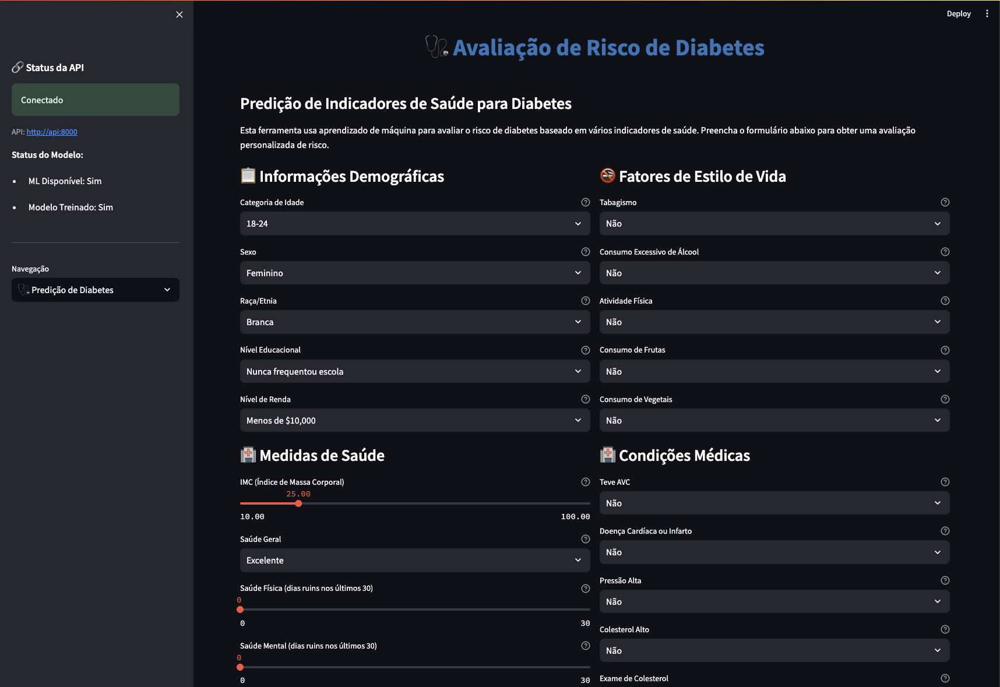

# Sistema de Predição de Diabetes

**Sistema de Machine Learning para predição de risco de diabetes usando dados reais de saúde com interface web**

⚠️ **ATENÇÃO: Apenas para Fins Educacionais**: Esta ferramenta é apenas para fins educacionais e de pesquisa. Não se destina ao uso clínico real. Sempre consulte profissionais de saúde qualificados para decisões médicas. ⚠️

⚠️ **Educational Purpose Only**: This tool is for educational and research purposes only. Not intended for clinical use. Always consult healthcare professionals for medical decisions. ⚠️

## Destaques do Projeto

- **Pipeline Completo** - Da coleta até a predição
- **Machine Learning Explicável** - SHAP values para entendimento das decisões
- **Visualizações através de graficos** - matplotlib + seaborn integrados
- **Deploy com Docker** - Zero configuração, uma linha de comando e tudo up and running!
- **Registros Reais** - Dataset BRFSS2015 do Kaggle completo (mais de 250mil linhas de dados reais do CDC EUA)

## Inicialização:

```bash
# 1. Clone o repositório
git clone git@github.com:pagottoo/mle-fiap-fase3-diabetes-prediction.git mle-diabetes-prediction
cd mle-diabetes-prediction
```

## 1.1 Preparando a pasta `data/`:
Siga o README.md dentro de `data/`, para preparar o sistema antes de subir.
ATENÇÃO: é necessario baixar o data-set do Kaggle para inicializar o sistema, veja o README e o `scripts/download_data.py`. 

## 2. Execute o sistema completo
```bash
docker compose up --build -d
```

**Tudo pronto**



## 3. Links uteis:
### Dashboard: http://localhost:8501 (Interface Web)
### API Docs: http://localhost:8000/docs (Documentação)

## Como Usar?

### **Fazer Predição**
1. Acesse http://localhost:8501
2. Selecione "Predição de Diabetes"
3. Preencha os 21 campos de saúde
4. Clique em "Avaliar Risco"
5. Veja resultado + explicação SHAP

### **Analisar Dados**
1. Selecione "Análise de Dados"
2. Use filtros na sidebar (idade, BMI, sexo)
3. Explore gráficos interativos:
   - Distribuições de BMI
   - Fatores de risco
   - Correlações
   - Análise demográfica

### **Gerenciar Dados**
1. Selecione "Gerenciamento de Dados"
2. Faça upload de CSV próprio
3. Retreine modelo com novos dados
4. Acompanhe métricas de performance

### **4. Usar API**
Veja a documentação do Swagger 

## Contexto Acadêmico

### **Objetivo do Projeto**
- Demonstrar pipeline completo de ML
- Implementar boas práticas de engenharia
- Criar interface web

### **Dataset BRFSS2015**
- **Fonte:** CDC Behavioral Risk Factor Surveillance System
- **Período:** 2015
- **Registros:** 253,680 
- **Features:** 21 indicadores de saúde validados
- **Target:** Diabetes binário (sim/não)
- **Link:** https://www.kaggle.com/datasets/alexteboul/diabetes-health-indicators-dataset

### **Executar Testes**
```bash
# Testes unitários
pytest tests/

# Lint e formatação
black . && flake8 .
```

## Documentação
- **API Docs:** http://localhost:8000/docs

## License
Educational project - MIT License

## Disclaimer
**This software is for educational and research purposes only. It is not intended for clinical use or medical diagnosis. Always consult with qualified healthcare professionals for medical advice and decisions.**

**Desenvolvido com ❤️ (sangue e suor) para FIAP - Fase 3 - Machine Learning Engineering**